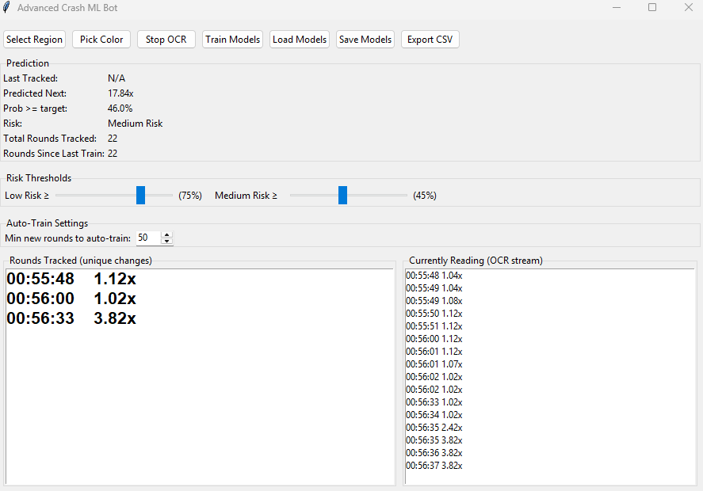

# Crash Predictor ML — OCR + Machine Learning Experiment

This project is an **experimental machine learning bot** that:
- Uses **OCR (EasyOCR + OpenCV)** to read crash multipliers live from the screen
- Tracks game history in real time
- Trains a **RandomForest Classifier + Regressor** (Scikit-Learn)
- Predicts the probability of high multipliers
- Provides a **Tkinter-based GUI** for live monitoring, settings, and training
- Supports auto-training and CSV logging for long sessions

⚠️ **Disclaimer:**  
This project is for **educational purposes only**.  
It is **not a guaranteed profit tool** and should not be used for gambling.  
The purpose is to demonstrate OCR, real-time data capture, and ML prediction pipelines.

---

## 🚀 Features
- **OCR Integration**: EasyOCR + OpenCV for screen capture and text recognition  
- **Machine Learning**: RandomForest Classifier & Regressor with auto-training  
- **GUI Dashboard**: Tkinter interface with live logs and model management  
- **Customizable Settings**: History window, feature rounds, training intervals  
- **Data Logging**: Saves predictions, outcomes, and retraining history to CSV  

---


## 📦 Requirements
- Python 3.10+  
- Packages: `numpy`, `pandas`, `scikit-learn`, `easyocr`, `opencv-python`, `tkinter`, `joblib`  

Install with:
```bash
pip install -r requirements.txt
